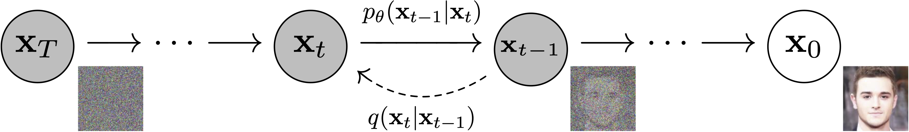

# Diffusion

Building generative diffusion models with PyTorch from scratch, which features scripts and guides covering from noise schedulers and U-Net architectures to training loops.

### 🧠 Diffusion Models

**Diffusion models** are a relatively recent addition to a group of algorithms known as **‘generative models’**. The goal of generative modeling is to learn to **generate** data, such as images or audio, given a number of training examples. A good generative model will create a **diverse** set of outputs that resemble the training data without being exact copies.

The secret to diffusion models’ success is the iterative nature of the **diffusion process**. Generation begins with **random noise**, but this is gradually refined over a number of steps until an output image emerges. At each step, the model estimates how we could go from the current input to a **completely denoised version**. However, since we only make a small change at every step, any errors in this estimate at the early stages (where predicting the final output is extremely difficult) can be corrected in later updates.

  
   
  
Diffusion process, figure from DDPM paper (https://arxiv.org/abs/2006.11239).

Training the model is relatively straightforward compared to some other types of generative model. We repeatedly 

1. Load in some images from the training data.
2. Add noise, in different amounts.
3. Feed the noisy versions of the inputs into the model.
4. Evaluate how well the model does at denoising these inputs.
5. Use this information to update the model weights.

To generate new images with a trained model, we begin with a completely random input and repeatedly feed it through the model, updating it each time by a small amount based on the model prediction.

### 🚰 MVP (Minimum Viable Pipeline)

The core API of Hugging Face Diffusers is divided into three main components:

1. **Pipelines**: high-level classes designed to rapidly generate samples from popular trained diffusion models in a user-friendly fashion.
2. **Models**: popular architectures for training new diffusion models, *e.g.* [UNet](https://arxiv.org/abs/1505.04597).
3. **Schedulers**: various techniques for generating images from noise during *inference* as well as to generate noisy images for *training*.

### ⏳ Define the Scheduler

The plan for training is to take these input images and add noise to them, then feed the noisy images to the model. And during inference, we will use the model predictions to iteratively remove noise. In `diffusers`, these processes are both handled by the **scheduler**. The noise schedule determines how much noise is added at different timesteps.

#### 🧪 **Forward Process** of a **Diffusion Probabilistic Model**:

**1. The Single Step Transition**

The following equation defines how we add a small amount of noise to the data at a specific timestep $t$, given its state at the previous timestep $t-1$:

$$
q(\mathbf{x}_t \vert \mathbf{x}_{t-1}) = \mathcal{N}(\mathbf{x}_t; \sqrt{1 - \beta_t} \mathbf{x}_{t-1}, \beta_t\mathbf{I})
$$

- **$q(\mathbf{x}_t \mid \mathbf{x}_{t-1})$**: This is the probability distribution of the latent variable $x_t$ conditioned on the previous latent variable $x_{t-1}$.

- **$\mathcal{N}(\dots)$**: Represents a Gaussian (Normal) distribution.

- **Mean ($\sqrt{1 - \beta_t} \mathbf{x}_{t-1}$)**: The mean of the new distribution is a slightly scaled-down version of the previous step. The parameter $\beta_t \in (0, 1)$ is a predefined variance schedule. Because $\sqrt{1 - \beta_t} < 1$, the original signal is slightly dampened at each step.

- **Variance ($\beta_t\mathbf{I}$)**: A small amount of isotropic Gaussian noise (scaled by $\beta_t$) is added. $\mathbf{I}$ is the identity matrix, ensuring the noise is added independently to all dimensions/pixels.

**2. The Complete Trajectory**

The following equation defines the joint distribution of the entire forward process sequence from timestep $1$ to $T$:

$$
q(\mathbf{x}_{1:T} \vert \mathbf{x}_0) = \prod^T_{t=1} q(\mathbf{x}_t \vert \mathbf{x}_{t-1})
$$

- **$q(\mathbf{x}_{1:T} \vert \mathbf{x}_0)$**: The probability of generating the entire sequence of increasingly noisy samples ($\mathbf{x}_1, \mathbf{x}_2, \dots, \mathbf{x}_T$) starting from the real, clean data point $\mathbf{x}_0$.

- **$\prod^T_{t=1}$**: This represents the product of all individual transition probabilities from $t=1$ to $T$.

- **Markov Chain**: Because the probability of $x_t$ depends *only* on the immediate previous step $x_{t-1}$, this forward noising process is a **Markov chain**.

**3. Summary**

In a diffusion model, this process is called the **Forward Process** (or Diffusion Process).

- It starts with a clean image ($\mathbf{x}_0$).

- It is gradually added tiny amounts of Gaussian noise over $T$ steps using the first formula.

- By the time when reaching the final step ($\mathbf{x}_T$), the original image is completely destroyed, leaving nothing but pure, isotropic Gaussian noise.

The goal of training a diffusion model is to learn the **reverse process** — learning to predict and subtract that noise step-by-step to turn pure random noise back into a clean, realistic image.

**4. The Closed-Form Sampling Formula** 

To get **$\mathbf{x}_t$** for any $t$ given $\mathbf{x}_0$, there is also another mathematical formulation for the forward (noising) process in Denoising Diffusion Probabilistic Models (DDPMs):

$$
q(\mathbf{x}_t \vert \mathbf{x}_0) = \mathcal{N}(\mathbf{x}_t; \sqrt{\bar{\alpha}_t} \mathbf{x}_0, (1 - \bar{\alpha}_t) \mathbf{I})
$$

- **$\mathbf{x}_0$**: The original, clean data point (e.g., an uncorrupted image).

- **$\mathbf{x}_t$**: The noisy latent state at arbitrary timestep $t$.

- **$\mathcal{N}(\mathbf{x}; \mathbf{\mu}, \mathbf{\Sigma})$**: A multivariate Gaussian distribution with mean $\mathbf{\mu}$ and covariance matrix $\mathbf{\Sigma}$.

- **$\mathbf{I}$**: The identity matrix.

The cumulative noise coefficient $\bar{\alpha}_t$ is calculated by multiplying the individual variance holding factors from the start up to the current timestep $t$:

$$
\bar{\alpha}_t = \prod_{i=1}^{t} \alpha_i
$$

Where each individual step's retention factor $\alpha_i$ is determined by the variance schedule $\beta_i$:

$$
\alpha_i = 1 - \beta_i
$$

Because of this identity, we do not need to iteratively apply noise $t$ times. Instead, we can sample the noisy state $\mathbf{x}_t$ directly at any timestep using:

$$
\mathbf{x}_t = \sqrt{\bar{\alpha}_t} \mathbf{x}_0 + \sqrt{1 - \bar{\alpha}_t} \mathbf{\epsilon} \quad \text{where} \quad \mathbf{\epsilon} \sim \mathcal{N}(\mathbf{0}, \mathbf{I})
$$

**Why do we write it this way:**

- **It preserves the scale:** Because $\alpha_t + (1 - \alpha_t) = 1$, the variance of the image doesn't blow up to infinity as we add noise. The overall "energy" or scale of the data remains constant.

- **It is differentiable:** Expressing the step this way isolates the stochastic (random) part into $\mathbf{\epsilon}_{t-1}$. This makes it possible to train neural networks using backpropagation later on, as the randomness is separated from the network's parameters.

#### **♾️Derivation**

**Step 1: The Single-Step Transition**

In a Denoising Diffusion Probabilistic Model (DDPM), the forward process is a Markov chain where noise is added at each step $t$ conditioned on the previous step $t-1$:

$$
q(\mathbf{x}_t \vert \mathbf{x}_{t-1}) = \mathcal{N}(\mathbf{x}_t; \sqrt{\alpha_t} \mathbf{x}_{t-1}, (1 - \alpha_t) \mathbf{I})
$$

This tells us that if we know what the image looked like at the previous step ($\mathbf{x}_{t-1}$), the next step ($\mathbf{x}_t$) will be sampled from a **Gaussian (Normal) distribution** where:

- **The Mean ($\mathbf{\mu}$)** is a slightly scaled-down version of the previous image: $\sqrt{\alpha_t} \mathbf{x}_{t-1}$

- **The Covariance/Variance ($\mathbf{\Sigma}$)** is a small amount of diagonal noise: $(1 - \alpha_t) \mathbf{I}$

Sampling from any Gaussian distribution $\mathcal{N}(\mathbf{\mu}, \mathbf{\Sigma})$ can be rewritten by taking the mean and adding scaled, standard random noise. This is known as the **reparameterization trick**:

$$
\text{Sample} = \text{Mean} + \sqrt{\text{Variance}} \times \mathbf{\epsilon}
$$

Where $\mathbf{\epsilon}$ (epsilon) is a random draw from a standard normal distribution, $\mathbf{\epsilon} \sim \mathcal{N}(\mathbf{0}, \mathbf{I})$.

Applying this to our single-step transition formula, we can write this transition as a generative equation by introducing an independent and identically distributed (i.i.d.) standard Gaussian noise term $\mathbf{\epsilon}_{t-1} \sim \mathcal{N}(\mathbf{0}, \mathbf{I})$:

$$
\mathbf{x}_t = \sqrt{\alpha_t} \mathbf{x}_{t-1} + \sqrt{1 - \alpha_t} \mathbf{\epsilon}_{t-1} \quad \text{--- (Equation 1)}
$$

**Step 2: Recursive Substitution**

We can express the previous step, **$\mathbf{x}_{t-1}$**, in the exact same way using the step before it, **$\mathbf{x}_{t-2}$**:

$$
\mathbf{x}_{t-1} = \sqrt{\alpha_{t-1}} \mathbf{x}_{t-2} + \sqrt{1 - \alpha_{t-1}} \mathbf{\epsilon}_{t-2} \quad \text{where } \mathbf{\epsilon}_{t-2} \sim \mathcal{N}(\mathbf{0}, \mathbf{I})
$$

Now, substitute this expression for $\mathbf{x}_{t-1}$ back into **Equation 1**:

$$
\mathbf{x}_t = \sqrt{\alpha_t} \left( \sqrt{\alpha_{t-1}} \mathbf{x}_{t-2} + \sqrt{1 - \alpha_{t-1}} \mathbf{\epsilon}_{t-2} \right) + \sqrt{1 - \alpha_t} \mathbf{\epsilon}_{t-1}
$$

Distribute the $\sqrt{\alpha_t}$ term:

$$
\mathbf{x}_t = \sqrt{\alpha_t \alpha_{t-1}} \mathbf{x}_{t-2} + \sqrt{\alpha_t(1 - \alpha_{t-1})} \mathbf{\epsilon}_{t-2} + \sqrt{1 - \alpha_t} \mathbf{\epsilon}_{t-1} \quad \text{--- (Equation 2)}
$$

**Step 3: Merging the Gaussian Noise Terms**

We now have two independent Gaussian noise terms in our equation:

$$
\sqrt{\alpha_t(1 - \alpha_{t-1})} \mathbf{\epsilon}_{t-2} \sim \mathcal{N}(\mathbf{0}, \alpha_t(1 - \alpha_{t-1})\mathbf{I})
$$

$$
\sqrt{1 - \alpha_t} \mathbf{\epsilon}_{t-1} \sim \mathcal{N}(\mathbf{0}, (1 - \alpha_t)\mathbf{I})
$$

When you add two independent Gaussian random variables, $X \sim \mathcal{N}(0, \sigma_1^2 \mathbf{I})$ and $Y \sim \mathcal{N}(0, \sigma_2^2 \mathbf{I})$, their sum is also Gaussian with a variance equal to the sum of their individual variances:

$$
X + Y \sim \mathcal{N}(0, (\sigma_1^2 + \sigma_2^2) \mathbf{I})
$$

Let's sum the variances of our two noise terms:

$$
\sigma_{\text{combined}}^2 = \alpha_t(1 - \alpha_{t-1}) + (1 - \alpha_t)
$$

$$
\sigma_{\text{combined}}^2 = \alpha_t - \alpha_t \alpha_{t-1} + 1 - \alpha_t
$$

$$
\sigma_{\text{combined}}^2 = 1 - \alpha_t \alpha_{t-1}
$$

Because the combined variance is $1 - \alpha_t \alpha_{t-1}$, we can collapse these two noise terms into a single new standard Gaussian noise variable $\mathbf{\epsilon}^* \sim \mathcal{N}(\mathbf{0}, \mathbf{I})$ scaled by the square root of the combined variance:

$$
\mathbf{x}_t = \sqrt{\alpha_t \alpha_{t-1}} \mathbf{x}_{t-2} + \sqrt{1 - \alpha_t \alpha_{t-1}} \mathbf{\epsilon}^*
$$

**Step 4: Generalizing to $t$ Steps**

If we repeat this recursive substitution and noise-merging process all the way back to the starting image $\mathbf{x}_0$, we get:

$$
\mathbf{x}_t = \sqrt{\alpha_t \alpha_{t-1} \dots \alpha_1} \mathbf{x}_0 + \sqrt{1 - \alpha_t \alpha_{t-1} \dots \alpha_1} \mathbf{\epsilon}
$$

By defining our cumulative product $\bar{\alpha}_t$ as:

$$
\bar{\alpha}_t = \prod_{i=1}^{t} \alpha_i
$$

The equation simplifies directly to:

$$
\mathbf{x}_t = \sqrt{\bar{\alpha}_t} \mathbf{x}_0 + \sqrt{1 - \bar{\alpha}_t} \mathbf{\epsilon} \quad \text{where } \mathbf{\epsilon} \sim \mathcal{N}(\mathbf{0}, \mathbf{I})
$$

This confirms that the transition probability distribution from step $0$ directly to step $t$ is indeed:

$$
q(\mathbf{x}_t \vert \mathbf{x}_0) = \mathcal{N}(\mathbf{x}_t; \sqrt{\bar{\alpha}_t} \mathbf{x}_0, (1 - \bar{\alpha}_t) \mathbf{I})
$$
